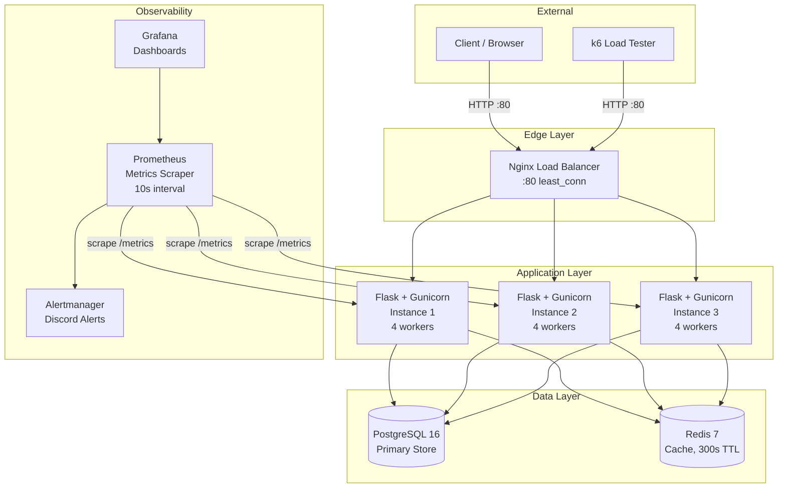
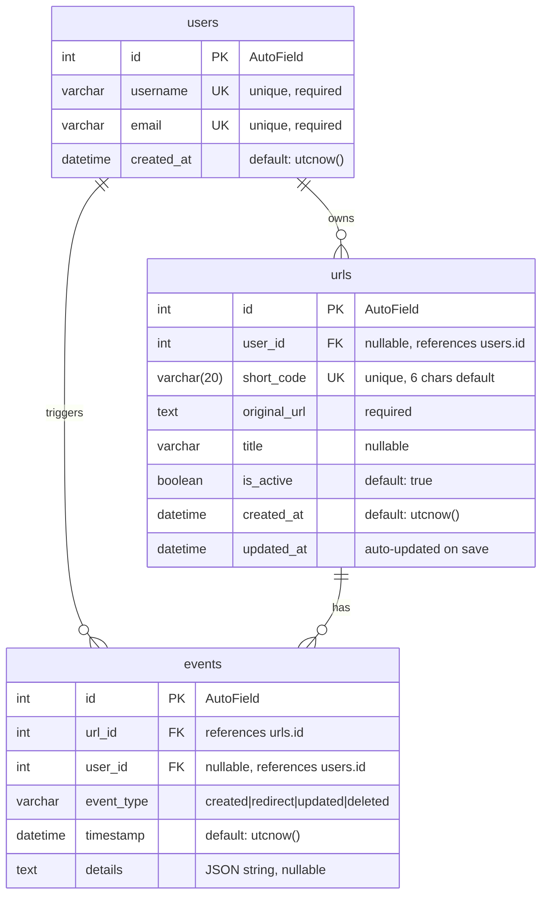

# System Architecture

## Component Diagram



## Data Flow: URL Creation

```
Client                 Nginx              Flask              PostgreSQL         Redis
  |                      |                  |                     |               |
  |-- POST /urls ------->|                  |                     |               |
  |                      |-- proxy -------->|                     |               |
  |                      |                  |-- validate JSON --->|               |
  |                      |                  |                     |               |
  |                      |                  |-- validate URL fmt  |               |
  |                      |                  |                     |               |
  |                      |                  |-- validate user_id  |               |
  |                      |                  |   (if provided) --->|               |
  |                      |                  |<-- User exists -----|               |
  |                      |                  |                     |               |
  |                      |                  |-- generate_short_code()             |
  |                      |                  |   (6 chars, secrets.choice)         |
  |                      |                  |                     |               |
  |                      |                  |-- INSERT url ------>|               |
  |                      |                  |<-- url_obj ---------|               |
  |                      |                  |                     |               |
  |                      |                  |-- INSERT event ---->|               |
  |                      |                  |   (type=created)    |               |
  |                      |                  |                     |               |
  |                      |<-- 201 + JSON ---|                     |               |
  |<-- 201 + JSON -------|                  |                     |               |
```

On short code collision (unique constraint violation), the system retries with a new random code, up to 10 attempts. With 62^6 = 56.8 billion possible codes and ~2,000 existing records, collision probability per attempt is approximately 0.000004%.

## Data Flow: Redirect (Cache Miss)

```
Client                 Nginx              Flask              PostgreSQL         Redis
  |                      |                  |                     |               |
  |-- GET /aB3xYz ------>|                  |                     |               |
  |                      |-- proxy -------->|                     |               |
  |                      |                  |-- GET url:aB3xYz -->|               |
  |                      |                  |<-- nil (miss) ------|               |
  |                      |                  |                     |               |
  |                      |                  |-- SELECT url      ->|               |
  |                      |                  |   WHERE short_code  |               |
  |                      |                  |   AND is_active     |               |
  |                      |                  |<-- url_obj ---------|               |
  |                      |                  |                     |               |
  |                      |                  |-- SETEX url:aB3xYz ----------->|
  |                      |                  |   TTL=300s, json data           |
  |                      |                  |                     |               |
  |                      |                  |-- INSERT event ---->|               |
  |                      |                  |   (type=redirect)   |               |
  |                      |                  |                     |               |
  |                      |<-- 302 + Location|                     |               |
  |                      |   X-Cache: MISS  |                     |               |
  |<-- 302 + Location ---|                  |                     |               |
```

## Data Flow: Redirect (Cache Hit)

```
Client                 Nginx              Flask                               Redis
  |                      |                  |                                    |
  |-- GET /aB3xYz ------>|                  |                                    |
  |                      |-- proxy -------->|                                    |
  |                      |                  |-- GET url:aB3xYz ---------------->|
  |                      |                  |<-- JSON data (hit) ---------------|
  |                      |                  |                                    |
  |                      |                  |-- INSERT event ---> PostgreSQL     |
  |                      |                  |   (type=redirect)                  |
  |                      |                  |                                    |
  |                      |<-- 302 + Location|                                    |
  |                      |   X-Cache: HIT   |                                    |
  |<-- 302 + Location ---|                  |                                    |
```

On cache hit, PostgreSQL is still contacted to record the redirect event, but the URL lookup itself is skipped.

## Database Schema



### Table: users

| Column | Type | Constraints | Description |
|---|---|---|---|
| id | AutoField (serial) | PRIMARY KEY | Auto-incrementing ID |
| username | CharField | UNIQUE, NOT NULL | Display name |
| email | CharField | UNIQUE, NOT NULL | Email address |
| created_at | DateTimeField | NOT NULL | Account creation timestamp |

### Table: urls

| Column | Type | Constraints | Description |
|---|---|---|---|
| id | AutoField (serial) | PRIMARY KEY | Auto-incrementing ID |
| user_id | ForeignKeyField | NULLABLE, FK -> users.id | Owner of the URL |
| short_code | CharField(20) | UNIQUE, NOT NULL | Random alphanumeric code |
| original_url | TextField | NOT NULL | Destination URL |
| title | CharField | NULLABLE | Human-readable label |
| is_active | BooleanField | NOT NULL, DEFAULT true | Soft-delete flag |
| created_at | DateTimeField | NOT NULL | Creation timestamp |
| updated_at | DateTimeField | NOT NULL | Auto-updated on each save |

### Table: events

| Column | Type | Constraints | Description |
|---|---|---|---|
| id | AutoField (serial) | PRIMARY KEY | Auto-incrementing ID |
| url_id | ForeignKeyField | NOT NULL, FK -> urls.id | The URL this event belongs to |
| user_id | ForeignKeyField | NULLABLE, FK -> users.id | User who triggered the event |
| event_type | CharField | NOT NULL | One of: `created`, `redirect`, `updated`, `deleted` |
| timestamp | DateTimeField | NOT NULL | When the event occurred |
| details | TextField | NULLABLE | JSON-encoded payload |

## Caching Strategy

Redis is used as a read-through cache for the redirect hot path.

**Cache key format:** `url:{short_code}`

**Cache value:** JSON string containing:
```json
{
  "original_url": "https://example.com/page",
  "url_id": 42,
  "user_id": 1
}
```

**TTL:** 300 seconds (5 minutes)

**Cache invalidation:** When a URL is updated (`PUT /urls/:id`) or soft-deleted (`DELETE /urls/:id`), the corresponding cache key is explicitly deleted.

**Graceful degradation:** If Redis is unavailable, the application falls back to querying PostgreSQL directly. The `_get_redis()` helper returns `None` on any connection error, and all Redis operations are wrapped in try/except blocks that silently fall back.

**Cache behavior by operation:**

| Operation | Cache Action |
|---|---|
| `GET /:short_code` (miss) | Set cache with 300s TTL |
| `GET /:short_code` (hit) | Read from cache, skip DB lookup |
| `PUT /urls/:id` | Delete cache key for the short code |
| `DELETE /urls/:id` | Delete cache key for the short code |
| `POST /urls` | No cache action (first access will populate) |

## Load Balancing

Nginx distributes requests across 3 Flask instances using the `least_conn` algorithm, which routes each new connection to the server with the fewest active connections.

```nginx
upstream flask_app {
    least_conn;
    server app1:5000;
    server app2:5000;
    server app3:5000;
}
```

**Why least_conn over round-robin:** Redirect requests vary in duration (cache hit vs. miss, event logging overhead). Least-connection routing naturally accounts for this variance by avoiding sending new requests to a server still processing a slow request.

**Nginx configuration details:**
- Proxy timeouts: connect 10s, send 30s, read 30s
- Buffer sizes: 128k initial, 4x256k
- Structured JSON access logs
- Pass-through of `X-Cache` header from Flask
- Health endpoint at `/nginx-health` (bypasses upstream)
- Stub status at `/nginx-status` for monitoring

## Monitoring Pipeline

```
Flask (app1,2,3)             Prometheus                 Grafana
     |                           |                         |
     |-- /metrics (every 10s) -->|                         |
     |                           |-- store TSDB            |
     |                           |   (7d retention)        |
     |                           |                         |
     |                           |-- evaluate rules ------>|
     |                           |   (every 15s)     query |
     |                           |                         |
     |                           |-- alert if threshold -->|
     |                           |   exceeded              |
     |                           |                         |
                            Alertmanager                   |
                                 |                         |
                                 |-- Discord webhook       |
                                 |   (critical: 10s wait)  |
                                 |   (warning: 30s wait)   |
```

**Scrape configuration:** Prometheus scrapes all 3 Flask instances every 10 seconds via their `/metrics` endpoint.

**Alert rules:**
- **ServiceDown:** Flask instance unreachable for 1 minute (critical)
- **HighErrorRate:** >10% 5xx error rate over 5 minutes, sustained 2 minutes (warning)
- **HighLatency:** p95 latency >2 seconds over 5 minutes, sustained 3 minutes (warning)
- **HighMemoryUsage:** Process memory >512MB for 5 minutes (warning)

**Grafana dashboard panels:**
- Request Rate (by status code)
- Error Rate (4xx and 5xx)
- Request Latency (p50, p95, p99)
- Active URLs (gauge)
- URLs Created rate
- Redirects rate
- Cache Hit Ratio
- Instance Health (UP/DOWN)

**Data retention:** Prometheus retains 7 days of time-series data.
