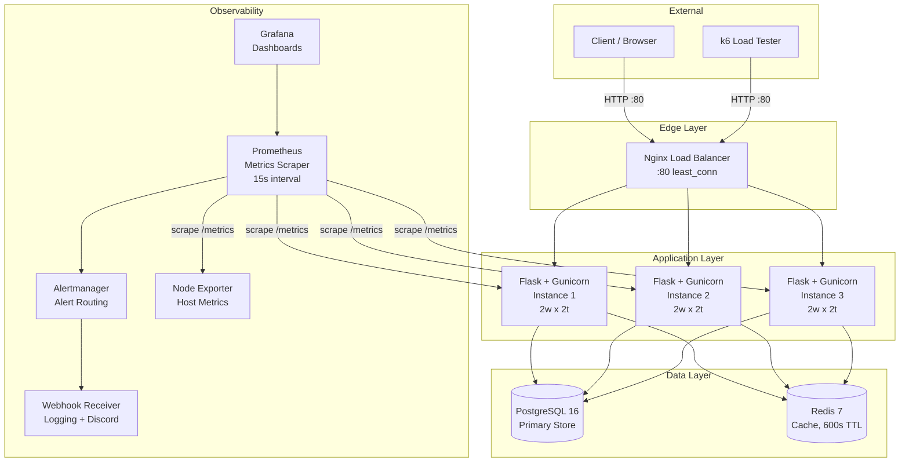
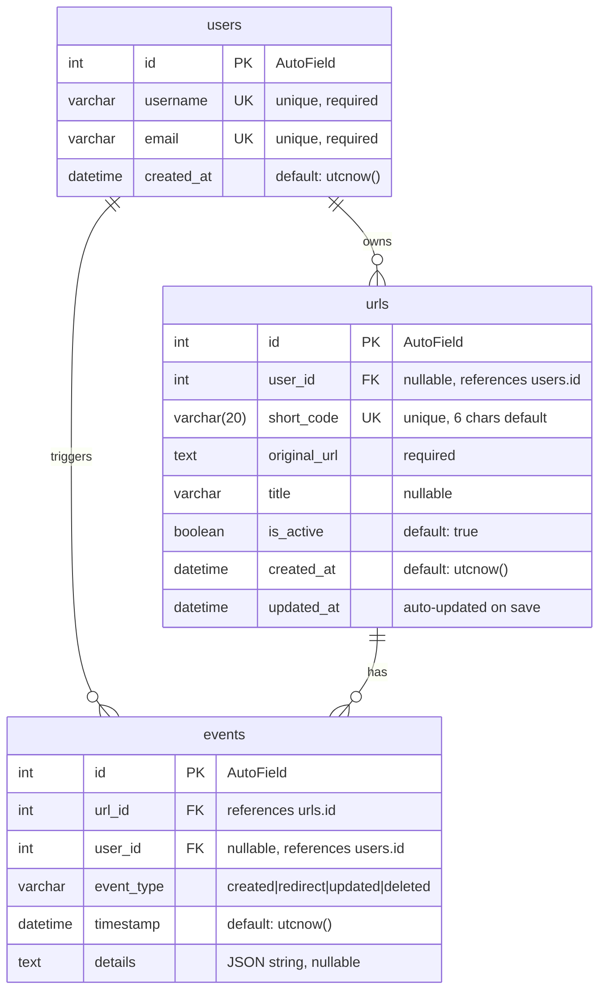

# System Architecture

## Component Diagram



## Detailed Data Flow Diagrams

Each operation is traced end-to-end through every system component, showing the exact sequence of internal calls, cache interactions, and database queries.

### Data Flow: URL Creation

```
Client                 Nginx              Flask              PostgreSQL         Redis
  |                      |                  |                     |               |
  |-- POST /urls ------->|                  |                     |               |
  |                      |-- proxy -------->|                     |               |
  |                      |                  |-- validate JSON --->|               |
  |                      |                  |                     |               |
  |                      |                  |-- validate URL fmt  |               |
  |                      |                  |                     |               |
  |                      |                  |-- validate user_id  |               |
  |                      |                  |   (if provided) --->|               |
  |                      |                  |<-- User exists -----|               |
  |                      |                  |                     |               |
  |                      |                  |-- generate_short_code()             |
  |                      |                  |   (6 chars, secrets.choice)         |
  |                      |                  |                     |               |
  |                      |                  |-- INSERT url ------>|               |
  |                      |                  |<-- url_obj ---------|               |
  |                      |                  |                     |               |
  |                      |                  |-- INSERT event ---->|               |
  |                      |                  |   (type=created)    |               |
  |                      |                  |                     |               |
  |                      |<-- 201 + JSON ---|                     |               |
  |<-- 201 + JSON -------|                  |                     |               |
```

On short code collision (unique constraint violation), the system retries with a new random code, up to 10 attempts. With 62^6 = 56.8 billion possible codes and ~2,000 existing records, collision probability per attempt is approximately 0.000004%.

## Data Flow: Redirect (Cache Miss)

```
Client                 Nginx              Flask              PostgreSQL         Redis
  |                      |                  |                     |               |
  |-- GET /aB3xYz ------>|                  |                     |               |
  |                      |-- proxy -------->|                     |               |
  |                      |                  |-- GET url:aB3xYz -->|               |
  |                      |                  |<-- nil (miss) ------|               |
  |                      |                  |                     |               |
  |                      |                  |-- SELECT url      ->|               |
  |                      |                  |   WHERE short_code  |               |
  |                      |                  |   AND is_active     |               |
  |                      |                  |<-- url_obj ---------|               |
  |                      |                  |                     |               |
  |                      |                  |-- SETEX url:aB3xYz ----------->|
  |                      |                  |   TTL=600s, json data           |
  |                      |                  |                     |               |
  |                      |                  |-- INSERT event ---->|               |
  |                      |                  |   (type=redirect)   |               |
  |                      |                  |                     |               |
  |                      |<-- 302 + Location|                     |               |
  |                      |   X-Cache: MISS  |                     |               |
  |<-- 302 + Location ---|                  |                     |               |
```

## Data Flow: Redirect (Cache Hit)

```
Client                 Nginx              Flask                               Redis
  |                      |                  |                                    |
  |-- GET /aB3xYz ------>|                  |                                    |
  |                      |-- proxy -------->|                                    |
  |                      |                  |-- GET url:aB3xYz ---------------->|
  |                      |                  |<-- JSON data (hit) ---------------|
  |                      |                  |                                    |
  |                      |                  |-- INSERT event ---> PostgreSQL     |
  |                      |                  |   (type=redirect)                  |
  |                      |                  |                                    |
  |                      |<-- 302 + Location|                                    |
  |                      |   X-Cache: HIT   |                                    |
  |<-- 302 + Location ---|                  |                                    |
```

On cache hit, PostgreSQL is still contacted to record the redirect event, but the URL lookup itself is skipped.

### Data Flow: URL Delete (Soft Delete)

```
Client                 Nginx              Flask              PostgreSQL         Redis
  |                      |                  |                     |               |
  |-- DELETE /urls/42 -->|                  |                     |               |
  |                      |-- proxy -------->|                     |               |
  |                      |                  |-- SELECT url ------>|               |
  |                      |                  |   WHERE id=42       |               |
  |                      |                  |<-- url_obj ---------|               |
  |                      |                  |                     |               |
  |                      |                  |-- UPDATE url ------>|               |
  |                      |                  |   SET is_active=F   |               |
  |                      |                  |<-- ok --------------|               |
  |                      |                  |                     |               |
  |                      |                  |-- INSERT event ---->|               |
  |                      |                  |   (type=deleted)    |               |
  |                      |                  |                     |               |
  |                      |                  |-- DEL url:code ------------>|
  |                      |                  |   (cache invalidate)        |
  |                      |                  |                     |               |
  |                      |<-- 204 ---------|                     |               |
  |<-- 204 --------------|                  |                     |               |
```

The soft delete sets `is_active = false` rather than removing the row. The cache key for this short code is explicitly deleted so that subsequent redirect attempts immediately see the URL as inactive (rather than waiting for TTL expiry).

### Data Flow: URL Update

```
Client                 Nginx              Flask              PostgreSQL         Redis
  |                      |                  |                     |               |
  |-- PUT /urls/42 ----->|                  |                     |               |
  |  {"url": "...",      |-- proxy -------->|                     |               |
  |   "is_active": true} |                  |                     |               |
  |                      |                  |-- SELECT url ------>|               |
  |                      |                  |   WHERE id=42       |               |
  |                      |                  |<-- url_obj ---------|               |
  |                      |                  |                     |               |
  |                      |                  |-- validate new URL  |               |
  |                      |                  |   (urlparse check)  |               |
  |                      |                  |                     |               |
  |                      |                  |-- UPDATE url ------>|               |
  |                      |                  |   SET original_url, |               |
  |                      |                  |       is_active     |               |
  |                      |                  |<-- ok --------------|               |
  |                      |                  |                     |               |
  |                      |                  |-- INSERT event x2 ->|               |
  |                      |                  |   (one per changed  |               |
  |                      |                  |    field)           |               |
  |                      |                  |                     |               |
  |                      |                  |-- DEL url:code ------------>|
  |                      |                  |   (cache invalidate)        |
  |                      |                  |                     |               |
  |                      |<-- 200 + JSON ---|                     |               |
  |<-- 200 + JSON -------|                  |                     |               |
```

Each changed field generates a separate `updated` event with the field name and new value. Cache invalidation ensures the next redirect for this short code fetches fresh data from PostgreSQL.

### Data Flow: User CRUD

```
Client                 Nginx              Flask              PostgreSQL
  |                      |                  |                     |
  |== POST /users ======>|                  |                     |
  |  {"username":"...",   |-- proxy -------->|                     |
  |   "email":"..."}     |                  |-- validate email    |
  |                      |                  |   (format check)    |
  |                      |                  |                     |
  |                      |                  |-- INSERT user ------>|
  |                      |                  |   (unique check on   |
  |                      |                  |    username + email)  |
  |                      |                  |<-- user_obj ---------|
  |                      |<-- 201 + JSON ---|                     |
  |<-- 201 + JSON -------|                  |                     |
  |                      |                  |                     |
  |== GET /users ========>|                 |                     |
  |  ?page=1&per_page=25 |-- proxy -------->|                     |
  |                      |                  |-- SELECT users ----->|
  |                      |                  |   ORDER BY id        |
  |                      |                  |   LIMIT 25 OFFSET 0  |
  |                      |                  |<-- [user, ...] ------|
  |                      |<-- 200 + JSON ---|                     |
  |<-- 200 + JSON -------|                  |                     |
  |                      |                  |                     |
  |== DELETE /users/1 ===>|                 |                     |
  |                      |-- proxy -------->|                     |
  |                      |                  |-- SELECT user ------>|
  |                      |                  |   WHERE id=1         |
  |                      |                  |<-- user_obj ---------|
  |                      |                  |                     |
  |                      |                  |-- DELETE user ------>|
  |                      |                  |   (hard delete)      |
  |                      |                  |<-- ok --------------|
  |                      |<-- 204 ---------|                     |
  |<-- 204 --------------|                  |                     |
```

User operations are straightforward CRUD with no caching layer. User deletes are hard deletes (the row is removed), unlike URL deletes which are soft deletes. The `ON DELETE SET NULL` behavior on the `urls.user_id` foreign key means deleting a user does not cascade to their URLs -- those URLs remain in the system with `user_id = NULL`.

---

## Database Schema



### Table: users

| Column | Type | Constraints | Description |
|---|---|---|---|
| id | AutoField (serial) | PRIMARY KEY | Auto-incrementing ID |
| username | CharField | UNIQUE, NOT NULL | Display name |
| email | CharField | UNIQUE, NOT NULL | Email address |
| created_at | DateTimeField | NOT NULL | Account creation timestamp |

### Table: urls

| Column | Type | Constraints | Description |
|---|---|---|---|
| id | AutoField (serial) | PRIMARY KEY | Auto-incrementing ID |
| user_id | ForeignKeyField | NULLABLE, FK -> users.id | Owner of the URL |
| short_code | CharField(20) | UNIQUE, NOT NULL | Random alphanumeric code |
| original_url | TextField | NOT NULL | Destination URL |
| title | CharField | NULLABLE | Human-readable label |
| is_active | BooleanField | NOT NULL, DEFAULT true | Soft-delete flag |
| created_at | DateTimeField | NOT NULL | Creation timestamp |
| updated_at | DateTimeField | NOT NULL | Auto-updated on each save |

### Table: events

| Column | Type | Constraints | Description |
|---|---|---|---|
| id | AutoField (serial) | PRIMARY KEY | Auto-incrementing ID |
| url_id | ForeignKeyField | NOT NULL, FK -> urls.id | The URL this event belongs to |
| user_id | ForeignKeyField | NULLABLE, FK -> users.id | User who triggered the event |
| event_type | CharField | NOT NULL | One of: `created`, `redirect`, `updated`, `deleted` |
| timestamp | DateTimeField | NOT NULL | When the event occurred |
| details | TextField | NULLABLE | JSON-encoded payload |

## Caching Strategy

Redis is used as a read-through cache for the redirect hot path.

**Cache key format:** `url:{short_code}`

**Cache value:** JSON string containing:
```json
{
  "original_url": "https://example.com/page",
  "url_id": 42,
  "user_id": 1
}
```

**TTL:** 600 seconds (10 minutes)

**Cache invalidation:** When a URL is updated (`PUT /urls/:id`) or soft-deleted (`DELETE /urls/:id`), the corresponding cache key is explicitly deleted.

**Graceful degradation:** If Redis is unavailable, the application falls back to querying PostgreSQL directly. The `_get_redis()` helper returns `None` on any connection error, and all Redis operations are wrapped in try/except blocks that silently fall back.

**Cache behavior by operation:**

| Operation | Cache Action |
|---|---|
| `GET /:short_code` (miss) | Set cache with 600s TTL |
| `GET /:short_code` (hit) | Read from cache, skip DB lookup |
| `PUT /urls/:id` | Delete cache key for the short code |
| `DELETE /urls/:id` | Delete cache key for the short code |
| `POST /urls` | No cache action (first access will populate) |

## Load Balancing

Nginx distributes requests across 3 Flask instances using the `least_conn` algorithm, which routes each new connection to the server with the fewest active connections.

```nginx
upstream flask_app {
    least_conn;
    server app1:5000;
    server app2:5000;
    server app3:5000;
}
```

**Why least_conn over round-robin:** Redirect requests vary in duration (cache hit vs. miss, event logging overhead). Least-connection routing naturally accounts for this variance by avoiding sending new requests to a server still processing a slow request.

**Nginx configuration details:**
- Proxy timeouts: connect 10s, send 30s, read 30s
- Buffer sizes: 128k initial, 4x256k
- Structured JSON access logs
- Pass-through of `X-Cache` header from Flask
- Health endpoint at `/nginx-health` (bypasses upstream)
- Stub status at `/nginx-status` for monitoring

## Monitoring Pipeline

```
Flask (app1,2,3)             Prometheus                 Grafana
     |                           |                         |
     |-- /metrics (every 10s) -->|                         |
     |                           |-- store TSDB            |
     |                           |   (7d retention)        |
     |                           |                         |
     |                           |-- evaluate rules ------>|
     |                           |   (every 15s)     query |
     |                           |                         |
     |                           |-- alert if threshold -->|
     |                           |   exceeded              |
     |                           |                         |
node-exporter                    |                         |
     |-- /metrics (every 15s) -->|                         |
     |                           |                         |
                            Alertmanager                   |
                                 |                         |
                                 |-- webhook receiver      |
                                 |   (logging + optional   |
                                 |    Discord forwarding)  |
                                 |   (critical: 5s wait)   |
                                 |   (warning: 15s wait)   |
```

**Scrape configuration:** Prometheus scrapes all 3 Flask instances every 10 seconds via their `/metrics` endpoint.

**Alert rules:**
- **ServiceDown:** Flask instance unreachable for 5 seconds (critical)
- **HighErrorRate:** >10% 5xx error rate over 5 minutes, sustained 2 minutes (warning)
- **HighLatency:** p95 latency >2 seconds over 5 minutes, sustained 1 minute (warning)
- **HighMemoryUsage:** Process memory >200MB for 5 minutes (warning)
- **CacheHitRatioLow:** Cache hit ratio <50% for 2 minutes (warning)
- **P99LatencyHigh:** p99 latency >5 seconds for 2 minutes (warning)

**Grafana dashboard panels:**
- Request Rate (by status code)
- Error Rate (4xx and 5xx)
- Request Latency (p50, p95, p99)
- Active URLs (gauge)
- URLs Created rate
- Redirects rate
- Cache Hit Ratio
- Instance Health (UP/DOWN)

**Data retention:** Prometheus retains 7 days of time-series data.

---

## Security Considerations

### Input Validation

All user-provided data is validated before processing. The application uses a defense-in-depth approach where validation occurs at multiple layers:

| Input | Validation Layer | Method | Threat Mitigated |
|-------|-----------------|--------|------------------|
| URL field | Application (`validators.py`) | `urlparse()` checks for `http`/`https` scheme and valid netloc | Open redirect, SSRF, protocol injection |
| Email field | Application (`validators.py`) | Format check: `local@domain.tld` structure | Data integrity |
| `user_id` | Application (route handler) | Type coercion to `int()`, existence check against DB | Type confusion, foreign key violation |
| `is_active` | Application (route handler) | `isinstance(value, bool)` check | Type confusion |
| `per_page` | Application (route handler) | `min(per_page, 100)` cap | Resource exhaustion via large result sets |
| `Content-Type` | Application (route handler) | `request.is_json` check, rejects non-JSON bodies | Payload confusion |
| Short code | Database (UNIQUE constraint) | Retry loop with cryptographic generation | Collision, enumeration |

### SQL Injection Prevention

The application uses the Peewee ORM for all database access. Peewee generates parameterized queries for all operations:

```python
# This Peewee code:
URL.get((URL.short_code == short_code) & (URL.is_active == True))

# Generates this parameterized SQL:
# SELECT * FROM urls WHERE short_code = %s AND is_active = %s
# Parameters: [short_code, True]
```

No raw SQL queries are used anywhere in the application. All user input passes through Peewee's query builder, which handles parameterization and escaping. This eliminates SQL injection as a vulnerability class.

### No Authentication Token Storage

The application does not implement authentication. There are no passwords, session tokens, API keys, or JWTs stored anywhere. This is a deliberate design choice for the hackathon scope -- the application is an open API. This means:

- No risk of credential leakage from database breaches
- No session management complexity
- No token validation overhead on every request

If authentication were added, it should use a separate identity provider (OAuth2/OIDC) rather than storing credentials in the application database.

### Additional Security Properties

| Property | Implementation |
|----------|---------------|
| Non-root container | Dockerfile creates `appuser` and switches to it via `USER appuser` |
| No debug mode in production | `FLASK_DEBUG` is not set in `docker-compose.yml` |
| Read-only config mounts | Nginx, Prometheus, Grafana configs are mounted with `:ro` flag |
| Unpredictable short codes | `secrets.choice()` uses OS cryptographic RNG (not `random`) |
| No sensitive data in logs | Structured JSON logs contain request metadata, not body content |
| Error response sanitization | Global error handlers return generic messages, not stack traces |

---

## Performance Architecture

### Caching Strategy

The caching architecture is designed around a single observation: redirect lookups are the dominant operation (70-80% of traffic), and the working set of active URLs is small enough to fit entirely in memory.

```
Request Flow for GET /:short_code

  1. Check Redis (0.3-0.8ms)
     |
     +-- HIT: Return cached URL, log event to PostgreSQL
     |         Total: ~5-15ms (dominated by event INSERT)
     |
     +-- MISS: Query PostgreSQL (~5-20ms)
               |
               +-- FOUND: Cache in Redis (SETEX, 600s TTL)
               |          Log event to PostgreSQL
               |          Total: ~20-50ms
               |
               +-- NOT FOUND: Return 404
                             No event logged, no caching
                             Total: ~5-10ms
```

**Cache key design:** `url:{short_code}` -- The key includes the short code directly, making it O(1) to look up. No scanning or pattern matching is needed.

**Cache value:** A JSON string (~150-300 bytes) containing `original_url`, `url_id`, and `user_id`. The `url_id` and `user_id` are included so the redirect event can be logged without a database read.

**Why 600-second TTL:**
- Short enough that URL updates/deletions are reflected within 10 minutes (even if cache invalidation fails)
- Long enough to maintain a 95%+ hit ratio under sustained load
- Combined with explicit invalidation on PUT/DELETE, staleness is minimal in practice
- All active URLs are pre-warmed into Redis on startup using pipelined writes

**Graceful degradation:** If Redis is unreachable, the `get_redis()` helper returns `None` and all cache operations are skipped. The application falls back to PostgreSQL with zero code path changes -- the same `try/except` blocks that handle cache misses also handle Redis unavailability.

### Connection Pooling

| Resource | Pool Strategy | Size | Configuration |
|----------|--------------|------|---------------|
| PostgreSQL connections | One connection per Gunicorn thread, opened in `before_request`, closed in `teardown_appcontext` | 3 instances x 2 workers x 2 threads = 12 max | Peewee's `connect(reuse_if_open=True)` |
| Redis connections | Singleton client per process, reused across requests | 1 per worker process = 6 max | `redis.from_url()` with connection pooling |
| Nginx upstream connections | Kept alive per-worker | 4096 `worker_connections` | Configured in `nginx.conf` events block |

### Load Balancing Algorithm

Nginx uses `least_conn` (least connections) routing:

```
Request arrives at Nginx:80
  |
  +-- Check active connection count for each upstream:
  |     app1:5000 -- 3 active connections
  |     app2:5000 -- 1 active connection
  |     app3:5000 -- 4 active connections
  |
  +-- Route to app2 (fewest active connections)
```

**Why least_conn over round-robin:**

Round-robin distributes requests evenly by count but ignores request duration. In this application, request durations vary significantly:
- Cache hit redirect: ~5-15ms
- Cache miss redirect: ~20-50ms
- URL creation: ~30-80ms (involves 2 INSERTs + unique code generation)

Under round-robin, a server handling multiple slow requests (cache misses, creates) would receive the same number of new requests as a server handling fast cache hits. Least-connection naturally accounts for this variance.

---

## Monitoring Architecture

### Metrics Pipeline

```
                              Scrape Interval: 10s
Flask App (app1:5000) ----+
Flask App (app2:5000) ----+----> Prometheus (:9090)
Flask App (app3:5000) ----+          |
                                     |
                              Scrape Interval: 15s
Node Exporter (:9100) ------------->+
                                     |
                                     |-- Store in TSDB (7-day retention)
                                     |
                                     |-- Evaluate alert rules (every 15s)
                                     |       |
                                     |       +--[FIRING]--> Alertmanager (:9093)
                                     |                           |
                                     |                           +-- Route by severity
                                     |                           |     critical: 5s group_wait
                                     |                           |     warning: 15s group_wait
                                     |                           |
                                     |                           +-- Webhook Receiver (:9094)
                                     |                                |
                                     |                                +-- Log to /var/log/alerts.log
                                     |                                +-- Write evidence JSON files
                                     |                                +-- Forward to Discord (optional)
                                     |
                                     +-- Serve queries --> Grafana (:3000)
                                                              |
                                                              +-- 8 dashboard panels
                                                              +-- Auto-refresh: 10s
                                                              +-- Auto-provisioned from JSON
```

### Alert Flow

When a threshold is breached, the alert traverses this path:

1. **Prometheus evaluates the rule** against scraped metrics every 15 seconds.
2. **The `for` duration must be sustained.** A brief spike is not enough -- the condition must persist for the configured duration (1m for ServiceDown, 2m for HighErrorRate, etc.).
3. **Prometheus sends the alert to Alertmanager** via the configured `alertmanagers` endpoint.
4. **Alertmanager groups alerts** by severity. Multiple alerts of the same severity within the `group_wait` window are batched into a single notification.
5. **Alertmanager sends the alert to the webhook receiver** (port 9094) which logs it to `/var/log/alerts.log` and writes an individual evidence JSON file. If `DISCORD_WEBHOOK_URL` is configured, the webhook receiver also forwards the alert to Discord.
6. **When the condition resolves**, Prometheus sends a resolution notification, and Alertmanager delivers a "resolved" message through the same webhook receiver pipeline.

### Dashboard Design

The Grafana dashboard (`grafana/dashboards/url-shortener.json`) is organized into logical sections:

| Panel | Metric Source | PromQL | Purpose |
|-------|--------------|--------|---------|
| Request Rate | `http_requests_total` | `sum(rate(http_requests_total[1m])) by (status)` | Overall traffic volume, broken down by HTTP status code |
| Error Rate | `http_requests_total` | `sum(rate(http_requests_total{status=~"[45].."}[5m])) / sum(rate(http_requests_total[5m]))` | Percentage of requests resulting in 4xx or 5xx |
| Request Latency | `http_request_duration_seconds` | `histogram_quantile(0.5/0.95/0.99, sum(rate(http_request_duration_seconds_bucket[5m])) by (le))` | p50, p95, p99 latency distribution |
| Active URLs | `active_urls` | `active_urls` | Gauge of currently active (non-deleted) URLs |
| URLs Created | `urls_created_total` | `rate(urls_created_total[5m])` | Rate of new URL creation |
| Redirects | `redirects_total` | `rate(redirects_total[5m])` | Rate of redirect operations |
| Cache Hit Ratio | `cache_hits_total`, `cache_misses_total` | `sum(rate(cache_hits_total[5m])) / (sum(rate(cache_hits_total[5m])) + sum(rate(cache_misses_total[5m])))` | Effectiveness of the Redis caching layer |
| Instance Health | `up` | `up{job="flask-app"}` | UP/DOWN status for each Flask instance |

### Key PromQL Queries for Operators

```promql
# Overall request rate (requests per second)
sum(rate(http_requests_total[1m]))

# Error rate as a percentage
sum(rate(http_requests_total{status=~"5.."}[5m])) / sum(rate(http_requests_total[5m])) * 100

# p95 latency by endpoint
histogram_quantile(0.95, sum(rate(http_request_duration_seconds_bucket[5m])) by (le, endpoint))

# Cache hit ratio
sum(rate(cache_hits_total[5m])) / (sum(rate(cache_hits_total[5m])) + sum(rate(cache_misses_total[5m])))

# Per-instance request rate
sum(rate(http_requests_total[1m])) by (instance)

# Active URLs count
active_urls

# Redirect rate
rate(redirects_total[5m])

# Memory usage per instance (in MB)
process_resident_memory_bytes / 1024 / 1024
```
